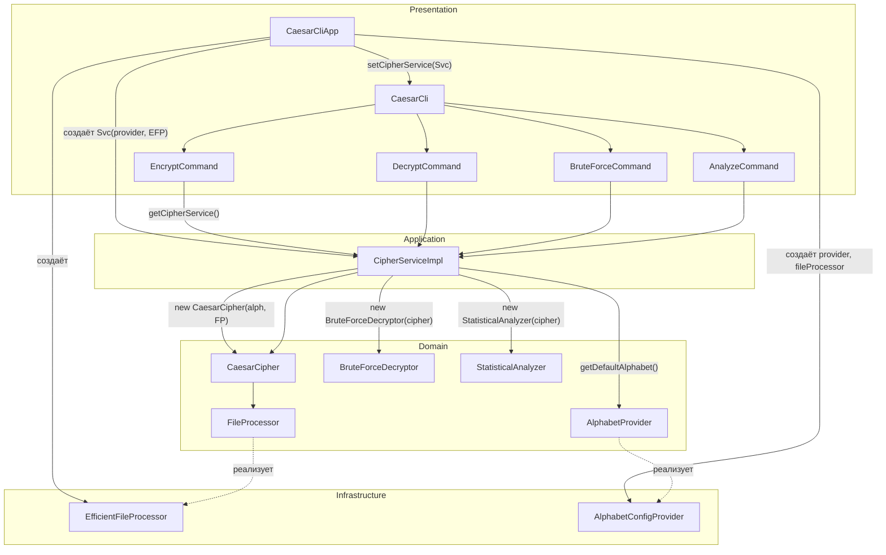

# Архитектура приложения

Краткое описание слоёв, зависимостей и потока управления. Подробнее о назначении проекта — в [README.md](README.md).

## Слои и направление зависимостей

Domain не зависит от Infrastructure: все технические детали входят в приложение через **порты** (интерфейсы в domain), реализации живут в infrastructure.

```
                    ┌─────────────────────────────────────────┐
                    │           PRESENTATION (CLI)             │
                    │  CaesarCliApp, CaesarCli, *Command      │
                    └─────────────────────┬───────────────────┘
                                          │ создаёт и передаёт
                                          ▼
                    ┌─────────────────────────────────────────┐
                    │            APPLICATION                   │
                    │  CipherServiceImpl                       │
                    │  (оркестрация: алфавит → шифр → команды) │
                    └──────────┬──────────────────┬───────────┘
                               │                   │
              зависит от       ▼                   ▼      зависит от
                    ┌─────────────────┐   ┌─────────────────────────┐
                    │     DOMAIN      │   │  DOMAIN PORTS (интерфейсы)│
                    │ CaesarCipher,   │   │  FileProcessor,          │
                    │ BruteForceDecryptor,  AlphabetProvider         │
                    │ StatisticalAnalyzer, │                         │
                    │ CipherService,  │   └────────────┬──────────────┘
                    │ EnhancedAlphabet,                │
                    │ AlphabetFactory │                │ реализуют
                    └─────────────────┘               ▼
                               ▲            ┌─────────────────────────┐
                               │            │     INFRASTRUCTURE      │
                    Domain     │            │  EfficientFileProcessor  │
                    не знает   │            │  AlphabetConfigProvider  │
                    об infra   │            │  AlphabetConfig,         │
                               └────────────  ApplicationConfig,     │
                                            │  SecurityConfig         │
                                            └─────────────────────────┘
```

## Диаграмма компонентов (упрощённая)

Ниже — связи между основными компонентами (кто кого создаёт или вызывает). Точка входа — `CaesarCliApp.main`.



## Роли компонентов

| Слой | Компонент | Роль |
|------|-----------|------|
| **Presentation** | `CaesarCliApp` | Точка входа; собирает провайдер алфавита, файловый процессор и `CipherService`, вешает сервис на CLI. |
| | `CaesarCli` | Корневая команда picocli; держит ссылку на `CipherService`, отдаёт её подкомандам через `@ParentCommand`. |
| | `*Command` (encrypt, decrypt, bruteforce, analyze) | Парсят аргументы, вызывают соответствующий метод `CipherService`. |
| **Application** | `CipherServiceImpl` | Получает алфавит через `AlphabetProvider`, создаёт `CaesarCipher` с `FileProcessor`, делегирует ему encrypt/decrypt и создаёт BruteForceDecryptor / StatisticalAnalyzer для режимов без ключа. |
| **Domain** | `CaesarCipher` | Шифрование/расшифровка по символам и строкам; работа с файлом — через порт `FileProcessor`. |
| | `BruteForceDecryptor` | Перебор ключей по образцу текста, оценка «похожести на язык» (частые слова, гласные/согласные). |
| | `StatisticalAnalyzer` | Подбор ключа по частоте символов или по сравнению с эталонным текстом. |
| | `FileProcessor` (порт) | Контракт: посимвольная обработка файла (ввод → преобразование → вывод). |
| | `AlphabetProvider` (порт) | Контракт: выдача алфавита по умолчанию или по типу. |
| **Infrastructure** | `EfficientFileProcessor` | Реализация `FileProcessor`: NIO, чанками, буфер настраивается. |
| | `AlphabetConfigProvider` | Реализация `AlphabetProvider` поверх `AlphabetConfig`. |
| | `AlphabetConfig`, `ApplicationConfig`, `SecurityConfig` | Конфигурация алфавита, приложения и проверка путей/расширений. |

## Поток данных (пример: шифрование файла)

1. Пользователь: `caesar encrypt input.txt output.txt -k 5`
2. `EncryptCommand` получает `CipherService` из `CaesarCli`, вызывает `service.encrypt(inputPath, outputPath, 5)`.
3. `CipherServiceImpl` вызывает `cipher.encryptFile(...)`.
4. `CaesarCipher` вызывает `fileProcessor.processFileByChunks(inputPath, outputPath, char -> encryptChar(char, 5))`.
5. `EfficientFileProcessor` читает файл чанками, применяет к каждому символу переданный `CharProcessor`, пишет результат.

Алфавит один раз при старте берётся из `AlphabetProvider` (в точке сборки в `CaesarCliApp`) и передаётся в `CaesarCipher`.

## Ограничения (важно знать)

- **Файловый ввод-вывод**: при очень маленьком буфере и многобайтовой кодировке (например UTF-8) граница чанка может разрезать символ; для типичных размеров буфера (десятки KB) и текстовых файлов это не проявляется.
- **Конфигурация**: `ApplicationConfig` при загрузке подмешивает все системные свойства; при необходимости жёстко ограничить конфиг можно фильтровать по префиксу (например `caesar.`).
